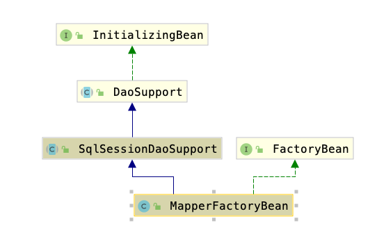

### 代码版本
```
<dependency>
<groupId>org.mybatis</groupId>
<artifactId>mybatis-spring</artifactId>
<version>2.0.4-SNAPSHOT</version>
</dependency>
```

### MapperScan注解扫描

```java
@Retention(RetentionPolicy.RUNTIME)
@Target(ElementType.TYPE)
@Documented
@Import(MapperScannerRegistrar.class)
@Repeatable(MapperScans.class)
public @interface MapperScan
```

- 引入MapperScannerRegistrar配置

- 通过registerBeanDefinitions方法引入MapperScannerConfigurer，配置MapperScannerConfigurer的相关参数，相关参数为MapperScan注解所配置，

- MapperScannerConfigurer内在调用postProcessBeanDefinitionRegistry方法时通过ClassPathMapperScanner进行扫包，ClassPathMapperScanner继承了ClassPathBeanDefinitionScanner重写doScan方法构建beanDefinitions。每个BeanDefinition的class都设置为MapperFactoryBean.class。

- MapperFactoryBean中有mapperInterface属性，在Bean实例化阶段会调用构造方法，将mapperInterface设置为项目中interface的class。
- MapperFactoryBean继承SqlSessionDaoSupport，SqlSessionDaoSupport继承DaoSupport，DaoSupport在调用afterPropertiesSet方法是会检查Configuration中是否配置了对应Mapper，如果没有添加，则通过MapperRegistry的addMapper方法加入。

MapperFactoryBean的引用如下图：

相应代码如下：

```java
@Override
protected void checkDaoConfig() {
super.checkDaoConfig();

notNull(this.mapperInterface, "Property 'mapperInterface' is required");

Configuration configuration = getSqlSession().getConfiguration();
if (this.addToConfig && !configuration.hasMapper(this.mapperInterface)) {
try {
configuration.addMapper(this.mapperInterface);
} catch (Exception e) {
logger.error("Error while adding the mapper '" + this.mapperInterface + "' to configuration.", e);
throw new IllegalArgumentException(e);
} finally {
ErrorContext.instance().reset();
}
}
}
```

```java
public <T> void addMapper(Class<T> type) {
if (type.isInterface()) {
if (this.hasMapper(type)) {
throw new BindingException("Type " + type + " is already known to the MapperRegistry.");
}

boolean loadCompleted = false;

try {
this.knownMappers.put(type, new MapperProxyFactory(type));
MapperAnnotationBuilder parser = new MapperAnnotationBuilder(this.config, type);
parser.parse();
loadCompleted = true;
} finally {
if (!loadCompleted) {
this.knownMappers.remove(type);
}

}
}

}
```

- knownMappers结构为Map<Class<?>, MapperProxyFactory<?>>，因此用做dao的interface都生成了一个代理类。

### mybatis执行dao调用过程

当我们断点调试时候会发现在代码执行过程中诸如以下配置的mapper的类型都是MapperProxy代理类。
```java
@Resource
private UserMapper userMapper

@Autowired
private ProductMapper productMapper
```

其实原因是执行CommonAnnotationBeanPostProcessor或者AutowiredAnnotationBeanPostProcessor通过反射的方式赋值。

我们知道每个dao的interface都被包装成了MapperFacotryBean,在MapperFactoryBean获取bean的时候会执行如下过程

- 调用getObject方法

```java
@Override
public T getObject() throws Exception {
return getSqlSession().getMapper(this.mapperInterface);
}
```

- 调用SqlSessionTemplate#getMapper
```java
@Override
public <T> T getMapper(Class<T> type) {
return getConfiguration().getMapper(type, this);
}
```

- 调用Configuration#getMapper
```java
public <T> T getMapper(Class<T> type, SqlSession sqlSession) {
return mapperRegistry.getMapper(type, sqlSession);
}
```

- 调用MapperRegistry#getMapper
```java
public <T> T getMapper(Class<T> type, SqlSession sqlSession) {
final MapperProxyFactory<T> mapperProxyFactory = (MapperProxyFactory<T>) knownMappers.get(type);
if (mapperProxyFactory == null) {
throw new BindingException("Type " + type + " is not known to the MapperRegistry.");
}
try {
return mapperProxyFactory.newInstance(sqlSession);
} catch (Exception e) {
throw new BindingException("Error getting mapper instance. Cause: " + e, e);
}
}
```

- 调用MapperProxyFactory#newInstance生成MapperProxy代理。
```java
protected T newInstance(MapperProxy<T> mapperProxy) {
return (T) Proxy.newProxyInstance(mapperInterface.getClassLoader(), new Class[] { mapperInterface }, mapperProxy);
}

public T newInstance(SqlSession sqlSession) {
final MapperProxy<T> mapperProxy = new MapperProxy<>(sqlSession, mapperInterface, methodCache);
return newInstance(mapperProxy);
}
```

最后，执行过程会调用MapperProxy的invoke方法，通过MapperMethod#execute来调用SqlSession执行具体语句。
