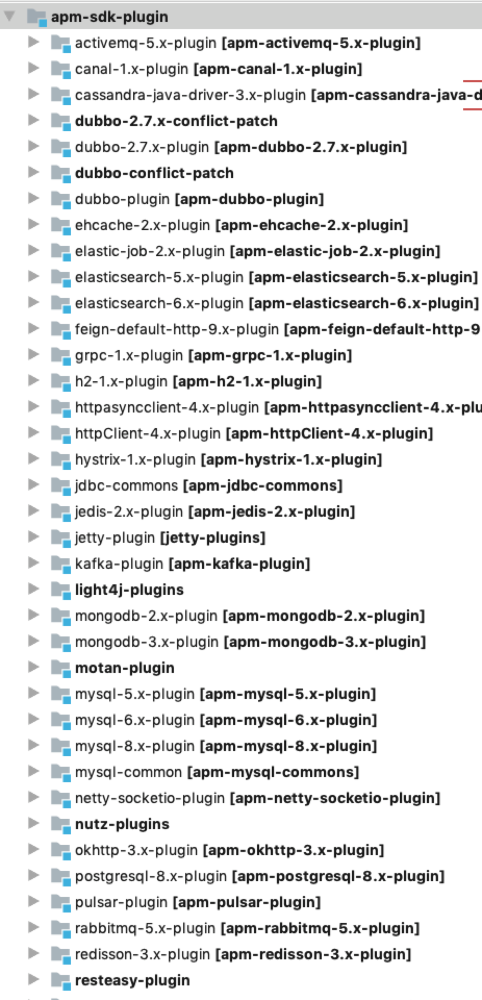

## 基本原理
我理解的skywalking是通过javaagent+bytebuddy+plugins方式实现的。

### javaagent

skywalking通过maven-shade-plugin打包，具体配置如下
```xml
<plugin>
    <artifactId>maven-shade-plugin</artifactId>
    <executions>
        <execution>
            <phase>package</phase>
            <goals>
                <goal>shade</goal>
            </goals>
            <configuration>
                <shadedArtifactAttached>false</shadedArtifactAttached>
                <createDependencyReducedPom>true</createDependencyReducedPom>
                <createSourcesJar>true</createSourcesJar>
                <shadeSourcesContent>true</shadeSourcesContent>
                <transformers>
                    <transformer implementation="org.apache.maven.plugins.shade.resource.ManifestResourceTransformer">
                        <manifestEntries>
                            <Premain-Class>${premain.class}</Premain-Class>
                            <Can-Redefine-Classes>${can.redefine.classes}</Can-Redefine-Classes>
                            <Can-Retransform-Classes>${can.retransform.classes}</Can-Retransform-Classes>
                        </manifestEntries>
                    </transformer>
                </transformers>
                <artifactSet>
                    <excludes>
                        <exclude>*:gson</exclude>
                        <exclude>io.grpc:*</exclude>
                        <exclude>io.netty:*</exclude>
                        <exclude>io.opencensus:*</exclude>
                        <exclude>com.google.*:*</exclude>
                        <exclude>com.google.guava:guava</exclude>
                    </excludes>
                </artifactSet>
                <relocations>
                    <relocation>
                        <pattern>${shade.net.bytebuddy.source}</pattern>
                        <shadedPattern>${shade.net.bytebuddy.target}</shadedPattern>
                    </relocation>
                </relocations>
                <filters>
                    <filter>
                        <artifact>net.bytebuddy:byte-buddy</artifact>
                        <excludes>
                            <exclude>META-INF/versions/9/module-info.class</exclude>
                        </excludes>
                    </filter>
                </filters>
            </configuration>
        </execution>
    </executions>
</plugin>
```
[maven-shade-plugin链接](https://maven.apache.org/plugins/maven-shade-plugin/)

### ByteBuddy
[ByteBuddy官网](https://bytebuddy.net/#/)
ByteBuddy 字节码生成工具，
通过BuyteBuddy在代码执行动作时植入作者想做的事情。

### plugin
skywalking适配了业界大部分主流的中间件，主要是通过apm-sniffer module下的apm-sdk-plugin来做这件事，这个module也是更新最频繁的，不断适配新的组件。



## 基本源码解读
### 入口
首先我们看到maven-shade-plugin配置的Premain-Class，

```xml
<premain.class>org.apache.skywalking.apm.agent.SkyWalkingAgent</premain.class>
```

SkyWalkingAgent的premain方法主要做了以下几件事
```java
public static void premain(String agentArgs, Instrumentation instrumentation) throws PluginException, IOException {
        final PluginFinder pluginFinder;
        try {
            // 配置相关config，包括通过java javaagent一些启动参数
            SnifferConfigInitializer.initialize(agentArgs);

            // 加载所有plugin，即apm-sdb-plugin module
            pluginFinder = new PluginFinder(new PluginBootstrap().loadPlugins());

        } catch (ConfigNotFoundException ce) {
            logger.error(ce, "SkyWalking agent could not find config. Shutting down.");
            return;
        } catch (AgentPackageNotFoundException ape) {
            logger.error(ape, "Locate agent.jar failure. Shutting down.");
            return;
        } catch (Exception e) {
            logger.error(e, "SkyWalking agent initialized failure. Shutting down.");
            return;
        }

        // 生成ByteBuddy
        final ByteBuddy byteBuddy = new ByteBuddy()
            .with(TypeValidation.of(Config.Agent.IS_OPEN_DEBUGGING_CLASS));

        AgentBuilder agentBuilder = new AgentBuilder.Default(byteBuddy)
            .ignore(
                nameStartsWith("net.bytebuddy.")
                    .or(nameStartsWith("org.slf4j."))
                    .or(nameStartsWith("org.groovy."))
                    .or(nameContains("javassist"))
                    .or(nameContains(".asm."))
                    .or(nameContains(".reflectasm."))
                    .or(nameStartsWith("sun.reflect"))
                    .or(allSkyWalkingAgentExcludeToolkit())
                    .or(ElementMatchers.<TypeDescription>isSynthetic()));

        JDK9ModuleExporter.EdgeClasses edgeClasses = new JDK9ModuleExporter.EdgeClasses();
        try {
            // 植入ByteBuddy运行时代码
            agentBuilder = BootstrapInstrumentBoost.inject(pluginFinder, instrumentation, agentBuilder, edgeClasses);
        } catch (Exception e) {
            logger.error(e, "SkyWalking agent inject bootstrap instrumentation failure. Shutting down.");
            return;
        }

        try {
            agentBuilder = JDK9ModuleExporter.openReadEdge(instrumentation, agentBuilder, edgeClasses);
        } catch (Exception e) {
            logger.error(e, "SkyWalking agent open read edge in JDK 9+ failure. Shutting down.");
            return;
        }

        agentBuilder
            .type(pluginFinder.buildMatch())
            .transform(new Transformer(pluginFinder))
            .with(AgentBuilder.RedefinitionStrategy.RETRANSFORMATION)
            .with(new Listener())
            .installOn(instrumentation);

        try {
            // 启动相关服务，即所有实现BootService的接口
            ServiceManager.INSTANCE.boot();
        } catch (Exception e) {
            logger.error(e, "Skywalking agent boot failure.");
        }

        // 配置shutdownhook
        Runtime.getRuntime().addShutdownHook(new Thread(new Runnable() {
            @Override public void run() {
                ServiceManager.INSTANCE.shutdown();
            }
        }, "skywalking service shutdown thread"));
    }
```

### plugin扫描
plugin扫描类似于spring boot的spring.factories扫描，当然springboot是通过spring.factories做SPI。而Skywalking使用JDK本身的SPI方式。具体扫描过程如下：
```java
pluginFinder = new PluginFinder(new PluginBootstrap().loadPlugins());
```

```java
public List<AbstractClassEnhancePluginDefine> loadPlugins() throws AgentPackageNotFoundException {
    AgentClassLoader.initDefaultLoader();

    PluginResourcesResolver resolver = new PluginResourcesResolver();
    List<URL> resources = resolver.getResources();
    ...
    return plugins;
}
```
```java
public List<URL> getResources() {
    List<URL> cfgUrlPaths = new ArrayList<URL>();
    Enumeration<URL> urls;
    try {
        urls = AgentClassLoader.getDefault().getResources("skywalking-plugin.def");

        while (urls.hasMoreElements()) {
            URL pluginUrl = urls.nextElement();
            cfgUrlPaths.add(pluginUrl);
            logger.info("find skywalking plugin define in {}", pluginUrl);
        }

        return cfgUrlPaths;
    } catch (IOException e) {
        logger.error("read resources failure.", e);
    }
    return null;
}
```
由此可见skywalking是通过扫描skywalking-plugin.def来进行插件的装载。

## SpringCloud plugin
这里以springcloud中NetflixFeignInstrumentation为例。

首先skywalking-plugin.def中定义插件入口
```xml
spring-cloud-feign-1.x=org.apache.skywalking.apm.plugin.spring.cloud.netflix.feign.v11.define.NetflixFeignInstrumentation
```

```java
public class NetflixFeignInstrumentation extends ClassInstanceMethodsEnhancePluginDefine {
    /**
     * Enhance class.
     */
    private static final String ENHANCE_CLASS = "org.springframework.cloud.netflix.feign.ribbon.LoadBalancerFeignClient";

    /**
     * Intercept class.
     */
    private static final String INTERCEPT_CLASS = "org.apache.skywalking.apm.plugin.feign.http.v9.DefaultHttpClientInterceptor";

    @Override protected ClassMatch enhanceClass() {
        return byName(ENHANCE_CLASS);
    }

    @Override public ConstructorInterceptPoint[] getConstructorsInterceptPoints() {
        return new ConstructorInterceptPoint[0];
    }

    @Override public InstanceMethodsInterceptPoint[] getInstanceMethodsInterceptPoints() {
        return new InstanceMethodsInterceptPoint[] {
            new InstanceMethodsInterceptPoint() {
                @Override public ElementMatcher<MethodDescription> getMethodsMatcher() {
                    return named("execute");
                }

                @Override public String getMethodsInterceptor() {
                    return INTERCEPT_CLASS;
                }

                @Override public boolean isOverrideArgs() {
                    return false;
                }
            }
        };
    }
}
```

通过对org.springframework.cloud.netflix.feign.ribbon.LoadBalancerFeignClient的类进行构造器和方法的拦截，植入的拦截类为org.apache.skywalking.apm.plugin.feign.http.v9.DefaultHttpClientInterceptor。
这里主要对LoadBalancerFeignClient的execute方法进行字节码重写。

```java
public class DefaultHttpClientInterceptor implements InstanceMethodsAroundInterceptor
```

植入的拦截器实现了InstanceMethodsAroundInterceptor接口，其中需要重写三个方法：
- beforeMethod
- afterMethod
- handleMethodException

我们通过org.apache.skywalking.apm.plugin.feign.http.v9.DefaultHttpClientInterceptor的beforeMethod来看看做了什么操作：
```java
public void beforeMethod(EnhancedInstance objInst, Method method, Object[] allArguments,
                             Class<?>[] argumentsTypes, MethodInterceptResult result) throws Throwable {
        Request request = (Request) allArguments[0];
        URL url = new URL(request.url());
        ContextCarrier contextCarrier = new ContextCarrier();
        int port = url.getPort() == -1 ? 80 : url.getPort();
        String remotePeer = url.getHost() + ":" + port;
        String operationName = url.getPath();
        FeignResolvedURL feignResolvedURL = PathVarInterceptor.URL_CONTEXT.get();
        if (feignResolvedURL != null) {
            try {
                operationName = operationName.replace(feignResolvedURL.getUrl(), feignResolvedURL.getOriginUrl());
            } finally {
                PathVarInterceptor.URL_CONTEXT.remove();
            }
        }
        if (operationName.length() == 0) {
            operationName = "/";
        }
        AbstractSpan span = ContextManager.createExitSpan(operationName, contextCarrier, remotePeer);
        span.setComponent(ComponentsDefine.FEIGN);
        Tags.HTTP.METHOD.set(span, request.method());
        Tags.URL.set(span, request.url());
        SpanLayer.asHttp(span);

        Field headersField = Request.class.getDeclaredField("headers");
        Field modifiersField = Field.class.getDeclaredField("modifiers");
        modifiersField.setAccessible(true);
        modifiersField.setInt(headersField, headersField.getModifiers() & ~Modifier.FINAL);

        headersField.setAccessible(true);
        Map<String, Collection<String>> headers = new LinkedHashMap<String, Collection<String>>();
        CarrierItem next = contextCarrier.items();
        while (next.hasNext()) {
            next = next.next();
            List<String> contextCollection = new LinkedList<String>();
            contextCollection.add(next.getHeadValue());
            headers.put(next.getHeadKey(), contextCollection);
        }
        headers.putAll(request.headers());

        headersField.set(request, Collections.unmodifiableMap(headers));
    }
```
这里解释了http调用时trace的信息是如何传输的：通过header进行传递，只不过这里不是通过拦截器的方式，而是在LoadBalancerFeignClient调用execute的方法时，通过ByteBuddy字节码重写来达到将trace信息存入header的目的。

这里额外扩展一下header传入trace信息后，skywalking如何插装springmvc接收？有兴趣读者可以查看org.apache.skywalking.apm.plugin.spring.mvc.v5.define.RestControllerInstrumentation这个类，本质是对Springmvc的注解比如@GetMapping、@PostMapping等等进行插装来接收feign中header的信息。当然，skywalking对不同版本的spring实现不同。

## 总结
总的来说，skywalking这种方式使用起来方便，但伴随的是开发难度较大，需要对不同组件的底层都由了解才能灵活使用或者封装自己的插件。
