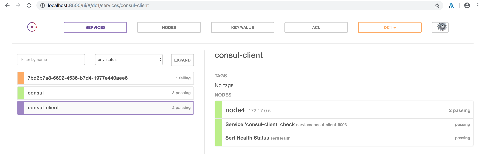

# 前言
在目前微服务很火爆的情况下，SpringCloud作为各种组件应有尽有并且开源的情况下受到很多公司青睐，这篇文章主要是针对consul作为服务注册中心的配置。
Eureka2.0闭源，加上Consul作为ServiceMesh提出理念下的一个新生产物，将来会受到恨到青睐。

# 环境搭建
Consul的官网：[https://www.consul.io/](https://www.consul.io/)

## consul配置
这里采用docker配置一个consul集群，3个server端，1个client端

```
# consul cluster by docker
# run the first server node expecting at least two more nodes to form a Consul cluster
docker run -d --name node1 -h node1 progrium/consul -server -bootstrap-expect 3

# other two nodes will join the first one using its IP (in Docker network)
JOIN_IP="$(docker inspect -f '{{.NetworkSettings.IPAddress}}' node1)"

# run second server node
docker run -d --name node2 -h node2 progrium/consul -server -join $JOIN_IP

# run third server node
docker run -d --name node3 -h node3 progrium/consul -server -join $JOIN_IP

# run fourth *client* node, this time exposing Consul ports to the host machine
# it'll be able to communicate with the cluster but will not participate in the consensus quorum
docker run -d -p 8400:8400 -p 8500:8500 -p 8600:53/udp --name node4 -h node4 progrium/consul -join $JOIN_IP
```

## SpringCloud服务配置

```
@EnableDiscoveryClient
@SpringBootApplication
public class Application {

	public static void main(String[] args) {
		new SpringApplicationBuilder(Application.class).web(true).run(args);
	}

}
```
这个很多读者应该都了解过，不赘述。

这里着重讲一下application.properties的配置

```
spring.application.name=consul-client
server.port=9093

# consul注册中心的url
spring.cloud.consul.host=localhost
# consul注册中心port
spring.cloud.consul.port=8500
spring.cloud.consul.discovery.enabled=true
spring.cloud.consul.discovery.register=true
spring.cloud.consul.discovery.prefer-ip-address=true
spring.cloud.consul.discovery.register-health-check=true
spring.cloud.consul.discovery.hostname=localhost 

# 健康检测的url，如果不配置，健康检测一定失败
spring.cloud.consul.discovery.health-check-path=/health
# 健康检测时间间隔
spring.cloud.consul.discovery.health-check-interval=10s
```
启动之后访问http://localhost:8500


# 总结
- 这个配置选项是自己试出来的，官网目前没有好的说明。
- spring-cloud-consul这个项目目前还不完善，Issues还很多。[spring-cloud-consul链接](https://github.com/spring-cloud/spring-cloud-consul)